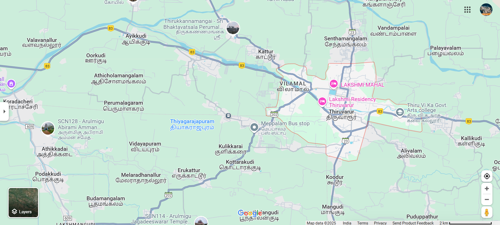

# Ex04 Places Around Me
## Date: 23.04.2025

## AIM
To develop a website to display details about the places around my house.

## DESIGN STEPS

### STEP 1
Create a Django admin interface.

### STEP 2
Download your city map from Google.

### STEP 3
Using ```<map>``` tag name the map.

### STEP 4
Create clickable regions in the image using ```<area>``` tag.

### STEP 5
Write HTML programs for all the regions identified.

### STEP 6
Execute the programs and publish them.

## CODE
``` python 
map.html

<html>
    <head>
        <title>My City</title>
    </head>
    <body>
        <h1 align="center">
            <font color="red"><b>THIRUVARUR</b></font>
        </h1>
        <h3 align="center">
            <font color="blue"><b>RABIN R(212224230213)</b></font>
        </h3>
        <center>
            
            <map name="MyCity">
                <area shape="poly" coords="941,187,1151,185,943,291,1158,293" title="hotel" href="hotel.html">
                <area shape="poly" coords="532,45,1019,31,530,164,1034,160" title="perumal temple" href="temple.html">
                <area shape="poly" coords="26,276,275,275,32,375,287,375" title="amman temple" href="amman temple.html ">
            </map>
        </center>  
    </body>
</html>

hotel.html

<html>
    <head>
        <title>My City</title>
    </head>
    <body>
        <h1 align="center">
            <font color="red"><b>THIRUVARUR</b></font>
        </h1>
        <h2 align="center">
            <font color="green"><b>Hhotel</b></font>
        </h2>
        <br>
        <hr size="3" color="yellow">
        <br>
        <center>
        </center>
        <p align="justify">
            <font face="Georgia" size="5" color="black">
                comfortable rooms with air conditioning, TVs, and in-room amenities. Some locations also feature a banquet hall for events, secure parking, and even free breakfast.
            </font>
        </p>
    </body>
</html>

temple.html

<html>
    <head>
        <title>My City</title>
    </head>
    <body>
        <h1 align="center">
            <font color="red"><b>THIRUVARUR</b></font>
        </h1>
        <h2 align="center">
            <font color="green"><b>temple</b></font>
        </h2>
        <br>
        <hr size="3" color="yellow">
        <br>
        <center>
        </center>
        <p align="justify">
            <font face="Georgia" size="5" color="black">
                sacred sites dedicated to Lord Vishnu, a central deity in the Hindu trinity, and are prevalent in Tamil Nadu, particularly in the Kanchipuram region. They are often called "Divya Desam,"
            </font>
        </p>
    </body>
</html>

amman temple.html

<html>
    <head>
        <title>My City</title>
    </head>
    <body>
        <h1 align="center">
            <font color="red"><b>THIRUVARUR</b></font>
        </h1>
        <h2 align="center">
            <font color="green"><b>amman temple</b></font>
        </h2>
        <br>
        <hr size="3" color="yellow">
        <br>
        <center>
        </center>
        <p align="justify">
            <font face="Georgia" size="5" color="black">
                the prominent "Amman" temple is the Sri Maha Saraswathi Amman Temple. This temple is dedicated to Goddess Saraswathi, and it is believed to be the only temple in South India specifically for this deity.
            </font>
        </p>
    </body>
</html>

```


## OUTPUT



## RESULT
The program for implementing image maps using HTML is executed successfully.
